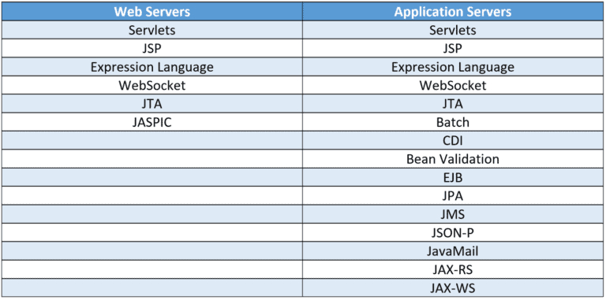

### Servlet and Servlet Container (Web Server):

### Web Server vs Application Server:
application servers have full support for the Java EE spec, whereas web servers (a.k.a Servlet Container) support a small subset of that functionality

* Application Servers Can Contain
    - Servlets
    - JSP (Java Server Pages)
    - Expression Language
    - WebSocket
    - JTA (Java Transaction API)
    - Batch
    - CDI (Contexts and Dependency Injection) 
    - Bean Validation
    - EJB (Jakarta Enterprise Beans)
    - JPA (Java Persistence API )
    - JMS (Java Message Service)
    - JSON-P
    - JavaMail
    - JAX-RS (Java/Jakarta RESTful API Web Services )
    - JAX-WS (creating and consuming Simple-Object-Access-Protocol/SOAP API for XML Web Services )

* Web Server (aka Servlet Container) Contains a Subset of the Application Server Specification
    - Servlets
    - JSP (Java Server Pages)
    - Expression Language
    - WebSocket
    - JTA
    - JASPIC

* Application Server Example
    - `Apache TomEE` (open source), full application server built on top of the standard Apache Tomcat
    - `Oracle WebLogic`
    - `WebSphere` by IBM
    - `WildFly` (Open Source) by Red Hat
    - `Apache Geronimo` (Open Source)
    - `GlassFish` (Open Source) sponsored by Oracle

* Web Server Example
    - `Apache Tomcat` (Open Source) most popular
    - `Jetty` (Open Source) developed by Eclipse Foundation, lightweight and fast. it’s so lightweight, it can be easily embedded in devices, frameworks, and application servers. Naturally, the project is open-source and you can contribute to it here. Used by Apache ActiveMQ, Eclipse, Google App Engine, Apache Hadoop and Atlassian Jira.

Guide: https://www.baeldung.com/java-servers.

### Applet ():
Java applets were small applications written in the Java programming language, or another programming language that compiles to Java bytecode, and delivered to users in the form of Java bytecode. The user launched the Java applet from a web page, and the applet was then executed within a Java virtual machine (JVM) in a process separate from the web browser itself. A Java applet could appear in a frame of the web page, a new application window, a program from Sun called appletviewer, or a stand-alone tool for testing applets.

History: 

When Internet (became available in 1993 for General Public) is gaining popularity, Browser wars started. Netscape (later Mozilla) has 86% and IE has 10% market share as users can choose/install their own browser. Then Microsoft began integrating IE within it's Windows OS and bundling deals with OEMs. So by 1999 it had 99% of the market. That time IE was also available for Apple's OS. Later IE was announced Windows only support.

Back to Applet, SUN Micro-System (maker of Java) and Netscape (later Mozilla) jointly developed `SWING`, this `SWING` components are produced by Java itself and are called `Applet`. Therefore now it is platform-independent as well as some additional features have also been added which were not in AWT (Abstract Window Toolkit) technology.