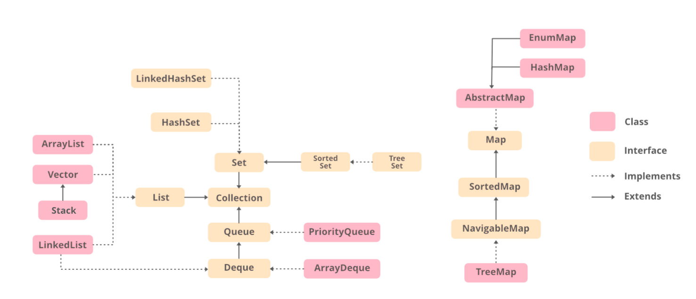

### Java Lambda:
In Java, Lambda expressions are used to express instances of `functional interfaces` (An interface with a single abstract method is called a functional interface, SAM in kotlin).

* Note: that lambda expressions can only be used to implement functional interfaces. So, have to define a functional interface first then implement the lambda block, then call. Or a Framework can define the Interface, consumer needs to define the implementation. 

* lambda body can contain zero, one, or more statements. 
* for single statement curly brackets are not mandatory and `return` is implicit
* return type of the anonymous function is the same as the type of the value returned within the code block, or void if nothing is returned.

```java
// FuncInterface is an functional interface (An interface with single abstract method)
interface FuncInterface
{
	void abstractFun(int x);

	// A non-abstract (or default) function
	default void normalFun() {
	    System.out.println("Hello");
	}
}

class Test
{
	public static void main(String args[])
	{
		// lambda expression to implements abstractFun() Functional Interface
		FuncInterface fobj = (int x) -> System.out.println(2*x);
		fobj.abstractFun(7); // outputs 14

        FuncInterface fob2 = (int x) -> {
            System.out.println(x);
            System.out.println(2*x);
        };
	}
}
```
### @FunctionalInterface Annotation and Built-in FI:
@FunctionalInterface annotation is used to ensure that the functional interface can’t have more than one abstract method. In case more than one abstract methods are present, the compiler flags an ‘Unexpected @FunctionalInterface annotation’ message. However, it is not mandatory to use this annotation.

- Runnable –> This interface only contains the run() method.
- Comparable –> This interface only contains the compareTo() method.
- ActionListener –> This interface only contains the actionPerformed() method.
- Callable –> This interface only contains the call() method.


### Java SE and four main kinds of functional interfaces
- Consumer FI => accepts only one argument or a gentrified argument has no return value (returns nothing). Bi-Consumer interface takes two arguments.

- Predicate FI => In scientific logic, a function that accepts an argument and, in return, generates a boolean value as an answer is known as a predicate. there are IntPredicate, DoublePredicate, and LongPredicate. Bi-Predicate is an extension of the Predicate functional interface which accepts two arguments, does some processing, and returns the boolean value.

- Function FI => it's a type of functional interface that receives a single argument and returns a value after the required processing. There is also Bi-Function variant

- Supplier FI => this does not take any input/argument but returns some output. there are BooleanSupplier, DoubleSupplier, LongSupplier, and IntSupplier. 

Guide => https://www.geeksforgeeks.org/functional-interfaces-java/

### Spring @Been:
A bean is an object that is instantiated, assembled, and managed by a Spring IoC container (` IoC: Inversion of Control`). It's like seed in other terms, but rather than we creating, we supplied the requirements and Spring will do the rest of job, like creating the object/s in a specific point where everything is ready and manage it's lifecycle. 
```java
@Bean
CommandLineRunner initDatabase(EmployeeRepository repository) {
    return args -> {
        log.info("Preloading " + repository.save(new Employee("Bilbo Baggins", "burglar")));
        log.info("Preloading " + repository.save(new Employee("Frodo Baggins", "thief")));
    };
}
```
https://stackoverflow.com/questions/17193365/what-in-the-world-are-spring-beans

### Inversion-of-Control (IoC) and Dependency Injection (DI):
The Dependency-Injection (DI) pattern is a more specific version of IoC pattern.

The term Inversion of Control (IoC) originally meant any sort of programming style where an overall framework or run-time controlled the program flow (lifecycle of everything inside).

Inversion of Control (IoC) means that objects do not create other objects on which they rely to do their work. Instead, they get the objects that they need, from an outside source (for example, an xml configuration file or DI).

Dependency Injection (DI) means that this is done without the object intervention, usually by a framework component that passes constructor parameters and set properties

https://stackoverflow.com/questions/6550700/inversion-of-control-vs-dependency-injection.

### Visibility Modifier For Class:
Top level Class can have either `public` or implicit `package-private` (default, when there is no modifier mentioned) modifier. Inner or Nested class can use `private` and `protected` with the other two as well.

Note: In a java file, there can be only one top level `public` class. Other top level class must be non-public, like implicit `package-private` (default if no modifier declared) 

### Array, ArrayList vs List Interface:
`Array` in Java is fixed length. An Array of String type is `String[]`. New array is created using `new String[n]` or shorthand `{}` notation. can be multidimensional, length is used to read member count.

`List` is an Interface in Java, cannot instantiate directly. Immutable List can be created Using `Arrays.asList("a","b","c")`. size() is used to read member count.

`ArrayList`, `LinkedList`, `Stack`, etc implements the List interface and those are not fixed size. It can be a type which can be populated using `Arrays.asList("a","b","c")`;

`ArrayList` size is dynamic/not-fixed, but interface List size if fixed.




```java
List<String> al1 = Arrays.asList("a","b","c"); // adding or removing elements is not allowed
// al1.add("d"); // not allowed, will throw UnsupportedOperationException (Runtime Exception)
//  ArrayList<String> al2 = (ArrayList<String>) Arrays.asList("a","b","c"); // casting not possible

List<String> al1a = new ArrayList<>();
al1a.add("a");
System.out.println(al1a.get(0)); // a
ArrayList<String> al1b = (ArrayList<String>) al1a; // now casting is ok, but redundant. It can be auto/smart cast
System.out.println(al1b.get(0)); // a

ArrayList<String> al3 = new ArrayList<String>(Arrays.asList("a","b","c")); // explicit type is not required
al3.add("d"); // ok

ArrayList<String> al3a = new ArrayList<>(Arrays.asList("a","b","c")); // ok
ArrayList<String> al4 = new ArrayList<>(List.of(new String[]{"a", "b"})); // ok
al4.add("c"); // returns boolean
boolean al4b = al4.add("d"); // ok

String[] arr = {"a", "b"};
ArrayList<String> al4c = new ArrayList<>(List.of(arr)); // ok

List<String> al4d = new ArrayList<>(List.of(new String[]{"a", "b"})); // ok
al4d.add("c"); // ok
```

### Arrays.asList vs ArrayList<>(Arrays.asList(array))
Using Arrays.asList we can convert an array to a fixed-size List object. This List is just a wrapper that makes the array available as a list. No data is copied or created. Modification of the members of the new list will also modify original array.

```java
String[] stringArray = new String[] { "A", "B", "C", "D" };
List stringList = Arrays.asList(stringArray);

stringList.set(3, "E");
 
assertThat(stringList).containsExactly("A", "B", "C", "E"); // true
assertThat(stringArray).containsExactly("A", "B", "C", "E"); // true

// stringList.add("F"); // not allowed
```

`ArrayList<>(Arrays.asList(array))` create a List out of an array, which is an independent copy of the array. So modifying the new list won’t affect the original array. Additionally, we have all the capabilities of a regular ArrayList, like adding and removing elements.

```java
String[] stringArray = new String[] { "A", "B", "C", "D" }; 
List stringList = new ArrayList<>(Arrays.asList(stringArray));

stringList.set(3, "E");
 
assertThat(stringList).containsExactly("A", "B", "C", "E");
assertThat(stringArray).containsExactly("A", "B", "C", "D");
```

### Optional in Java:
```java
import java.util.Optional;
class JavaOptional {
    public static void main(String[] args)
    {

        // creating a string array
        String[] str = new String[5];

        // Setting value for 2nd index
        str[2] = "Testing Optionals in Java";

        // It returns an empty instance of Optional class
        Optional<String> empty = Optional.empty();
        System.out.println(empty); // Optional.empty

        // It returns a non-empty Optional
        Optional<String> value = Optional.of(str[2]);
        System.out.println(value); // Optional[Testing Optionals in Java]
        System.out.println(value.get()); // Testing Optionals in Java
        System.out.println(value.hashCode()); // 1119689728
        System.out.println(value.isPresent());// true

        Optional<String> emptyString = Optional.empty();
        String opCheck1 = emptyString.isPresent() ? emptyString.get() : "Its still not initialized";
        System.out.println(opCheck1); // Its still not initialized
        String opCheck2 = emptyString.isPresent() ? emptyString.get() : emptyString.orElseThrow(()->new RuntimeException("emptyString throwing runtime exception"));
    }
}
```